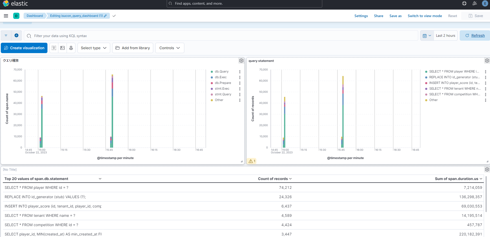

# ISUCON-Kibana-Dashboard

ISUCON用のKibana Dashboard




## Dashboardで確認できる内容


- 追加済
  - SQLクエリの実行状況

- 今後整備予定
  - Host状況
  - エンドポイントの負荷状況


## 使い方

### import方法

Kibanaの `Kibana` / `Saved Objects` からImportを行う。

`Create new objects with random IDs` オプションを選び取り込んでください


```
http://localhost:5601/app/management/kibana/objects
```


### export方法

Kibanaの `Kibana` / `Saved Objects` から該当する項目をチェックしてExportしてください。


